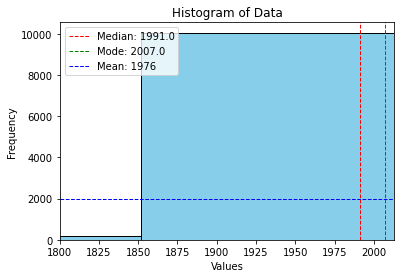
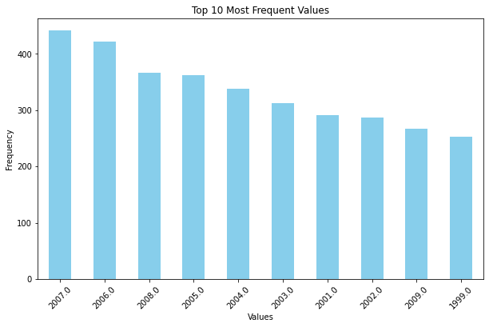

# تسک فنی

مجموعه داده booksummaries.txt به ما داده شده است و هدف آن ایجاد یک اسکریپت یا نوت بوک پایتون است که NLP، Computer Vision، Machine Learning و Data Visualization را برای تجزیه و تحلیل و درک مجموعه داده ای از خلاصه کتاب ها ترکیب می کند. این شامل پاکسازی داده ها، بررسی ویژگی های آن از طریق EDA، کوتاه کردن خلاصه ها و تبدیل آنها به تصاویر است که در زیر به تفصیل توضیح می دهیم. و ما می خواهیم با انجام این مراحل "خلاصه های متن فشرده"، "تصاویر تبدیل شده" و "یافته های حاصل از تجزیه و تحلیل داده های اکتشافی (EDA)" را بدست آوریم.

## پیش پردازش داده و تحلیل داده های اکتشافی (EDA)

### بارگذاری و پیش پردازش داده

- بارگذاری داده با استفاده کتابخانه pandas و افزودن هدر به آن.
- بررسی قسمتی از داده و دیدن شکل آن.
- حذف ستون‌های `Wikipedia article ID` و `Freebase ID` از داده ها.
- اضافه کردن ایندکس به دیتاست.
- تمیز کردن ژانر کتاب ها و تغییر ساختار آن به لیستی از ژانر.
- اضافه کردن ستون `Publication year` از روی ستون `Publication date` که فقط حاوی سال انتشار کتاب است.
- مشخص کردن ردیف‌های تکراری و حذف آن از طریق ستون های `Book title` و `Author`
- تمیز کردن ستون `Plot summary` با استفاده از کوچک کردن حروف، حذف علائم نگارشی، حذف اعداد، حذف فاصله های اضافی، حذف کاراکترهای خاص، حذف کلمات ربط(stopwords) و در نهایت پاک کردن فاصله های اضافی ابتدا و انتهای متن و اضافه کردن این محتوای جدید به عنوان ستون `Cleaned Summary`
- حذف داده های پرت با استفاده روش IQR
- پر کردن داده های گمشده `Author` با مقدار `Unknown` چون نمی توانیم کتاب شخص دیگری را به نام شخص دیگری ثبت کنیم
- پر کردن داده های گمشده `Book genres` با توجه به `Author` و ژانر دیگر کتاب های این نویسنده که موجود است و پیدا کردن 5 ژانر مرسوم کتاب های این نویسنده
- محاسبه میانه، مد و میانگین `Publication year` و رسم نمودار هیستوگرام آن  که از طریق آن متوجه شویم کدام یک از این موارد برای داده های گمشده `Publication Year` و `Publication date` مناسب است.

    </img>

- از طریق نمودار هیستوگرام به علت تداخل و زیاد بودن داده‌ها نمیتوان متوجه چیزی شد پس نمودار هیستوگرام را برای 10 سال برتر(Top 10) رسم میکنیم و متوجه میشویم که تمامی این 10 سال متعلق به 2000 به بعد است و به همین دلیل از مد به عنوان مقداری برای پر کردن داده های گمشده `Publication Year` و `Publication date` استفاده میکنیم.

    </img>

- در نهایت برای دیگر داده های گمشده `Book genres` مقدار `Unknown` را قرار می دهیم.
- در نهایت چک میکنیم که داده های گمشده برای هیچ کدام از ستون ها موجود نباشد.

برای مدیریت داده های گمشده روش های متعددی وجود دارد که یکی از آن ها را برای ستون `Book genres` به کار بردیم و آن نیز تشخیص ژانر کتاب ها بر اساس دیگر آثار نویسنده بوده است و پیدا کردن 5 ژانر مرسوم از این دیگر آثار بوده است ولی روش های دیگری نیز وجود دارد که می توانیم از آن استفاده کنیم که ما فقط سه مورد از آن را که برای این مسئله کاربرد دارد نام میبریم. اولین روش استفاده که نمی توانیم از آن استفاده کنیم روش `Forwardfill/Backwardfill` است که اگر داده های دارای توالی منطقی باشند می توانیم با استفاده از این روش داده های گمشده را پر کنیم. روش دیگر استفاده از منابع خارجی برای یافتن داده است مثل استفاده از دیتاست خارجی، استفاده از APIs(مثل Google Books API, GoodReads or Freebase) و یا با استفاده از نوشتن یک خزنده وب و پیدا کردن اطلاعات مورد نظر(ظاهرا مقادیر ستون `Wikipedia article ID` معتبر نیست). روش سوم نیز استفاده از یک مدل NLP از قبل آموزش دیده که بتواند به طور خاص ژانر کتاب‌ها را با توجه به نیاز ما تشخیص دهد.
