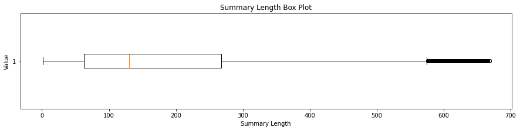
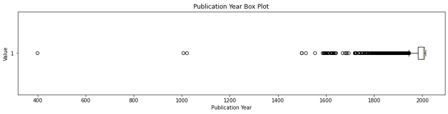
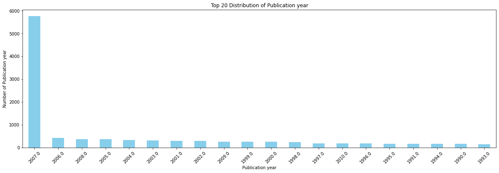
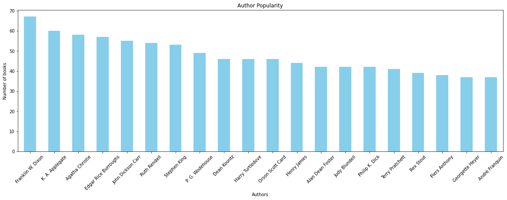
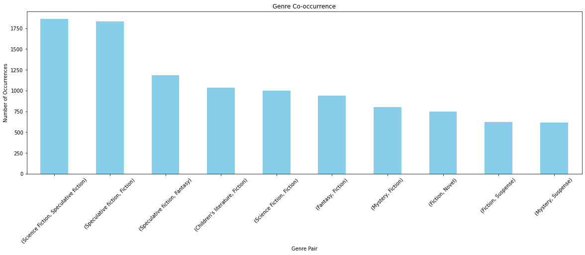

# Technical assessment

We are given the dataset `booksummaries.txt` and aim to create a Python script or notebook that combines NLP, Computer Vision, Machine Learning and Data Visualization to analyze and understand a dataset of book summaries. This includes cleaning the data, exploring its features through EDA, shortening the summaries and converting them to images, which we describe in detail below. And we want to get " The condensed text summaries", "The converted images" and " The findings from the exploratory data analysis (EDA)" by doing these steps.

## Data Preprocessing and EDA

### Load and preprocessing data

- Loading the data using the pandas library and adding a header to it.
- Display head of the data and shape of it.
- Removing the columns `Wikipedia article ID` and `Freebase ID` from the data.
- Adding an index to the dataset.
- Cleaning up the genres of the books and changing their structure to a list of genres.
- Adding the `Publication year` column based on the `Publication date` column, which only contains the year of publication of the book.
- Identifying duplicate rows and removing them based on the `Book title` and `Author` columns.
- Cleaning the `Plot summary` column involves converting text to lowercase, removing punctuation marks, eliminating numbers, deleting extra spaces, excluding special characters, removing stopwords, trimming leading and trailing spaces. Subsequently, it is checked whether the cleaned text is empty or not. If it is empty, the value is set to `NaN`, and if it is not empty, `the cleaned text` is recorded as the new content in the `Cleaned Summary` column.
- Dropping records where the `Cleaned Summary` column does not have a value.
- Removing outliers using the IQR method.
- Filling missing data in the `Author` column with the value `Unknown` as we cannot assign a book to a different author.
- Filling missing data in the `Book genres` based on the `Author` and other genres of books by this author that are available. Identifying the 5 common genres of books by this author.
- Calculating the median, mode, and mean of the `Publication year` and plotting a histogram to determine which of these measures is suitable for the missing `Publication Year` and `Publication date` data.

</img>

- Due to the overlap and abundance of data, it was not informative to plot a histogram. Therefore, we plot the histogram for the Top 10 years to see that all of these top 10 years belong to the period after 2000. Hence, we use the mode as a value to fill in the missing `Publication Year` and `Publication date` data.

</img>

- For other missing data in the `Book genres` column, we set the value to `Unknown`.
- we verify that there are no missing data left for any of the columns.
- Finally, we save the cleaned data in CSV format.

There are multiple methods for handling missing data, one of which we utilized for the `Book genres` column. This method involved inferring the genres of books based on other works by the author, identifying 5 common genres from these other works. However, there are other methods that we can employ, and we will mention three that are relevant to this issue. 

The first method we cannot use is the `Forwardfill/Backwardfill` method, which can fill in missing data if the data exhibits logical sequences. Another method involves utilizing external sources to find data, such as using external datasets, APIs (like Google Books API, GoodReads, or Freebase), or by writing a web scraper to gather the required information (apparently, the values in the `Wikipedia article ID` column are not valid). 

The third method involves using a pre-trained NLP model that can specifically identify book genres according to our needs.


### Understanding and Exploring Dataset Features through EDA

To explore the dataset and analyze its features, numerical analysis is conducted for numerical data, and non-numerical analysis is performed for non-numerical features such as book genres, which are described below:

- Reading the dataset saved from the previous stage, stored in a CSV file.
- Converting the book genres into a list of genres for non-numerical analysis.
- Printing basic information about the dataset such as the number of books and missing data.

```sh
Number of books: 15593
Missing values: False
```

- Performing numerical analysis on `Summary Length`, which refers to the length of book summaries, and visualizing the data using a box plot.

```sh
Summary length statistics:
count    15593.000000
mean       184.366575
std        155.291544
min          1.000000
25%         63.000000
50%        130.000000
75%        268.000000
max        668.000000
```

<div style="text-align:center;">
    </img>
</div>


- Performing numerical analysis on `Publication year`, which refers to the publication year of books, and displaying the data using a box plot.


```sh
Publication year statistics:
count    15593.000000
mean      1986.779581
std         42.171144
min        398.000000
25%       1982.000000
50%       2004.000000
75%       2007.000000
max       2013.000000
```

<div style="text-align:center;">
    </img>
</div>

- Analyzing the distribution of `Book genres`, which represent the genres of books, and displaying the top 10 genres with a bar chart. It's worth noting that in this scenario, each book has multiple genres, and the count of each genre's occurrences is shown.

```sh
Genre distribution:
Fiction                4401
Speculative fiction    3995
Unknown                3552
Science Fiction        2675
Novel                  2312
                       ... 
Popular culture           1
Neuroscience              1
Alien invasion            1
Comedy of manners         1
Pastiche                  1
Length: 223
```

<div style="text-align:center;">
    </img>
</div>

- Analyzing the distribution of `Publication year`, which represents the publication years of books, and displaying the top 20 publication years with a bar chart. It's important to note that the year 2007 has been chosen as the mode of the dataset, and this discrepancy arises from filling missing data with it.

```sh
Publication year distribution:

Publication year
2007.0    5756
2006.0     422
2008.0     366
2005.0     362
2004.0     338
          ... 
1590.0       1
1768.0       1
1621.0       1
1516.0       1
1640.0       1
Length: 264
```

<div style="text-align:center;">
    </img>
</div>


- Analyzing the popularity of authors (`Author`) and displaying the top 20 authors with a bar chart. However, in visualizing this analysis, the value `Unknown`, which was used for missing data in this column, has been removed and is not shown in the chart.


```sh
Author analysis:

Author
Unknown                 2294
Franklin W. Dixon         67
K. A. Applegate           60
Agatha Christie           58
Edgar Rice Burroughs      57
                        ... 
Mary Cheney                1
Nick Enright               1
Sion Sono                  1
Ntozake Shange             1
Stephen Colbert            1
Length: 4553
```

<div style="text-align:center;">
    </img>
</div>

- Analyzing the co-occurrence of book genres, which indicates which genres have occurred together most frequently, and displaying the top 10 co-occurrences with a bar chart.


```sh
(Science Fiction, Speculative fiction)    1860
(Speculative fiction, Fiction)            1829
(Speculative fiction, Fantasy)            1186
(Children's literature, Fiction)          1037
(Science Fiction, Fiction)                1001
(Fantasy, Fiction)                         941
(Mystery, Fiction)                         802
(Fiction, Novel)                           745
(Fiction, Suspense)                        620
(Mystery, Suspense)                        613
```

<div style="text-align:center;">
    </img>
</div>
