<style>*{direction: rtl}</style>


<h1>فهرست مطالب</h1>

- [تسک فنی](#تسک-فنی)
  - [پیش پردازش داده](#پیش-پردازش-داده)
    - [بارگذاری و پیش پردازش داده](#بارگذاری-و-پیش-پردازش-داده)
  - [کامپوننت پردازش زبان طبیعی](#کامپوننت-پردازش-زبان-طبیعی)
  - [پیش بینی کردن ژانر کتاب‌ها با استفاده از مدل Bert](#پیش-بینی-کردن-ژانر-کتابها-با-استفاده-از-مدل-bert)
  - [کامپوننت بینایی ماشین](#کامپوننت-بینایی-ماشین)
  - [تحلیل داده های اکتشافی (EDA)](#تحلیل-داده-های-اکتشافی-eda)


# تسک فنی

مجموعه داده [`booksummaries.txt`](../booksummaries.txt) به ما داده شده است و هدف آن ایجاد یک اسکریپت یا نوت بوک پایتون است که NLP، Computer Vision، Machine Learning و Data Visualization را برای تجزیه و تحلیل و درک مجموعه داده ای از خلاصه کتاب ها ترکیب می کند. این شامل پاکسازی داده ها، بررسی ویژگی های آن از طریق EDA، کوتاه کردن خلاصه ها و تبدیل آنها به تصاویر است که در زیر به تفصیل توضیح می دهیم. و ما می خواهیم با انجام این مراحل "خلاصه های متن فشرده"، "تصاویر تبدیل شده" و "یافته های حاصل از تجزیه و تحلیل داده های اکتشافی (EDA)" را بدست آوریم.


## پیش پردازش داده

### بارگذاری و پیش پردازش داده

- بارگذاری کردن متغیرهای محیطی
- بارگذاری داده با استفاده کتابخانه pandas و افزودن هدر به آن.
- بررسی قسمتی از داده و دیدن شکل آن.
- در این قسمت میتوانیم ستون‌های `Wikipedia_Article_ID` و `Freebase_ID` از داده‌ها حذف کنیم چون منحصر به فرد است و همچنین کارایی ندارد ولی با توجه به تسک آن را حذف نمیکنیم.
- اضافه کردن ایندکس به دیتاست.
- تمیز کردن ژانر کتاب ها و تغییر ساختار آن از دیکشنری به لیستی از ژانر با استفاده از حذف کلیدهای آن که `Freebase_ID` هستند.
- بررسی میکنیم که کدام یک از ستون‌ها missing value هستند. و با توجه به نتایج، ستون‌های `Author` و `Publication_Date` و `Book_Genres` هستند.
- در این بخش نیز از **Google Book API** استفاده میکنیم تا با توجه به `Book_Title` و `Author` در صورتی که موجود باشد اطلاعات کتاب یعنی `Author` و `Publication_Date` را از آن بگیریم و ذخیره کنیم.
- به عنوان نقطه بررسی اول، مجموعه داده را را جهت اطمینان ذخیره میکنیم. [لینک دیتاست](../checkpoint_datasets/checkpoint1_book_summaries.csv)
- اضافه کردن ستون `Publication_Year` از روی ستون `Publication_Date` که فقط حاوی سال انتشار کتاب است.
- تعداد ردیف‌های تکراری را از طریق ستون های `Book_Title` و `Author` مشخص می‌کنیم.
- تمیز کردن ستون `Plot_Summary` با استفاده از کوچک کردن حروف، حذف علائم نگارشی، حذف اعداد، حذف فاصله های اضافی، حذف کاراکترهای خاص، پاک کردن فاصله های اضافی ابتدا و انتهای متن و در نهایت بررسی میشود که آیا متن تمیز شده خالی است یا خیر و در صورت خالی بودن مقدار `NaN` و در صورت خالی نبودن `متن تمیز شده` به عنوان محتوای جدید در ستون `Cleaned_Summary` ثبت میشود.
- حذف رکوردهایی که ستون `Cleaned_Summary` آن مقدار ندارد.
- اضافه کردن ستون `Summary_Length` که طول `Cleaned_Summary` را ذخیره میکند و مشخص کردن تعداد داده های پرت با استفاده روش IQR از روی همین مقادیر همین ستون
- پر کردن داده های گمشده `Author` با مقدار `Unknown` چون نمی توانیم کتاب شخص دیگری را به نام شخص دیگری ثبت کنیم و نام نویسنده از طریق Google Book API یافت نشده است.
- پر کردن داده های گمشده `Book_Genres` با توجه به `Author` و ژانر دیگر کتاب های این نویسنده که موجود است و پیدا کردن 5 ژانر مرسوم کتاب های این نویسنده
- بررسی کردن تعداد داده های گمشده مجموعه داده
- محاسبه میانه، مد و میانگین `Publication year` و رسم نمودار هیستوگرام آن  که از طریق آن متوجه شویم کدام یک از این موارد برای داده های گمشده `Publication Year` و `Publication date` مناسب است.

<div style="text-align:center;">
    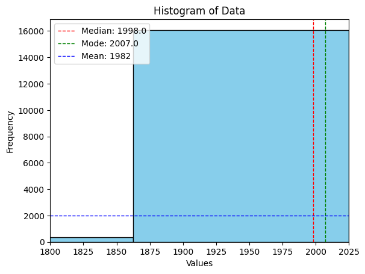</img>
</div>

- از طریق نمودار هیستوگرام به علت تداخل و زیاد بودن داده‌ها نمیتوان متوجه چیزی شد پس نمودار هیستوگرام را برای 10 سال برتر(Top 10) رسم میکنیم و متوجه میشویم که تمامی این 10 سال متعلق به 2000 به بعد است و به همین دلیل از مد به عنوان مقداری برای پر کردن داده های گمشده `Publication Year` و `Publication date` استفاده میکنیم.

<div style="text-align:center;">
    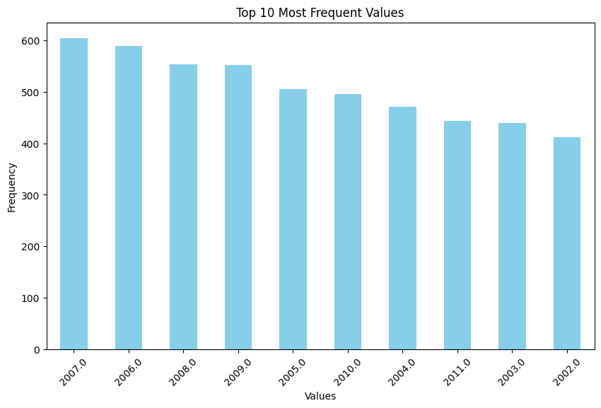</img>
</div>

- بررسی میکنیم که کدام یک از ستون ها دارای داده های گمشده هستند که متوجه میشویم تنها ستونی که دارای داده های گمشده است، ستون `Book_Genres` است. پس به مرحله 2 رفته و شروع به تولید خلاصه های متن های مورد نظر میکنیم. و در نهایت به عنوان نقطه بررسی دوم مجموعه داده را ذخیره میکنیم. [لینک دیتاست](../checkpoint_datasets/cleaned_book_summaries.csv)


## کامپوننت پردازش زبان طبیعی

در این بخش تسک خواسته شده از ما این بوده است که خلاصه کتاب‌های موجود در دیتاست را به خلاصه کوتاه‌تری تبدیل کنیم که ما نیز با استفاده مدل `facebook/bart-large-cnn` که نام عمومی آن BART است و از بین سه مدل BART و T5 و PEGASUS ما این مدل را انتخاب کردیم چون برای خلاصه های با کیفیت بالا و با فشرده سازی متوسط عالی بود بنابراین مدل را آماده کردیم که در صورت وجود GPU بتواند از آن استفاده کند و در صورت نبود آن از CPU. ‌دو تابع به نام‌های `summarize_batch` و `batch_summarization` تعریف کردیم که تابع اول کار گرفتن دسته‌ای از متن ها و خلاصه کردن آن با استفاده از مدل BART را به عهده دارد و تابع دوم کار مدیریت کردن داده‌های دیتاست و فرستادن آن به صورت دسته دسته را به عهده دارد که به مشکل کمبود حافظه رم(Memory error) برنخوریم. بعد از آن دو متن را به عنوان نمونه به مدل دادیم که اولین متن بلندترین متن مجموعه داده و دومین متن اولین متن مجموعه داده است و دقت و طول متن خلاصه شده را سنجیدیم که در زیر نتایج آن آورده شده است و همانطور که مشخص است برای متن اول که متن قبل از خلاصه شدن 10317 توکن یا به عبارتی میتوان گفت کلمه بوده است و بعد از استفاده از این مدل و خلاصه کردن متن به 51 کلمه کاهش پیدا کرده است. متن دوم نیز که طول متن قبل از خلاصه شدن 944 توکن بوده است و بعد از استفاده از این مدل و خلاصه کردن متن به 65 کلمه کاهش پیدا کرده است.


نتایج دقت مدل روی خلاصه کردن این متن اول نیز به صورت زیر است که با استفاده از کتابخانه `rouge_score` نتایج بدست آمده است.

```sh
Cleaned Summary lenght: 10317
Summarized Text lenght: 51


ROUGE-1:  Score(precision=1.0, recall=0.004935165473195278, fmeasure=0.009821858449687049)
ROUGE-2:  Score(precision=0.62, recall=0.0030000967773153972, fmeasure=0.0059712992391409035)
ROUGE-L:  Score(precision=0.8235294117647058, recall=0.004064253919101994, fmeasure=0.008088589311506982)
```
<br>
مقادیر ROUGE بدست آمده برای طولانی‌ترین متن در مجموعه داده، به ما بینش‌های ارزشمندی درباره عملکرد مدل خلاصه‌سازی ارائه می‌دهد. در زیر تجزیه و تحلیلی از این نتایج آورده شده است

<h3>ROUGE-1:</h3>

- **Precision = 1.0**: این نشان می‌دهد که 100٪ از unigrams (کلمات فردی) در خلاصه در متن اصلی حاضر هستند. خلاصه به طور انحصاری از کلمات متن اصلی تشکیل شده است.
- **Recall = 0.0049**: تنها حدود 0.49٪ از unigrams متن اصلی در خلاصه گنجانده شده‌اند. این بازخوانی بسیار کم نشان می‌دهد که خلاصه بسیار فشرده است.
- **F1-Score = 0.0098**: میانگین هارمونی بین دقت و بازخوانی به دلیل فاصله قابل‌توجهی بین دو مقدار پایین است. در حالی که مدل هر کلمه‌ای که انتخاب می‌کند را با دقت کامل گرفته است، اما تعداد بسیار کمی از کلمات متن اصلی در آن وجود دارند.

<h3>ROUGE-2:</h3>

- **Precision = 0.62**: این به این معناست که 62٪ از bigrams (جفت کلمات متوالی) در خلاصه در متن اصلی حاضر هستند. با این حال، این به اندازه دقت unigram نیست، که نشان می‌دهد در حالی که کلمات فردی به خوبی گرفته شده‌اند، ترتیب آن‌ها ممکن است به خوبی حفظ نشده باشد.
- **Recall = 0.0030**: حدود 0.3٪ از bigrams متن اصلی در خلاصه حاضر هستند، که نشان می‌دهد که تنها یک بخش بسیار کوچک از محتوای bigram اصلی گرفته شده است.
- **F1-Score = 0.0060**: امتیاز F1 به دلیل فاصله بزرگ بین دقت و بازخوانی بسیار پایین است، که نشان می‌دهد که خلاصه ممکن است دنباله‌های زبانی مهم را از دست داده باشد.

<h3>ROUGE-L:</h3>

- **Precision = 0.824**: حدود 82.4٪ از زیردنباله‌های مشترک بلند (LCS) بین خلاصه و متن اصلی حفظ شده‌اند، که نشان می‌دهد مدل کار منطقی‌ای برای حفظ ترتیب کلمات برای بخش‌هایی از متن اصلی که شامل آنها می‌شود انجام می‌دهد.
- **Recall = 0.0041**: تنها 0.41٪ از دنباله‌های متن اصلی در خلاصه ظاهر می‌شوند، که نشان می‌دهد در حالی که ترتیب کلمات حفظ شده است، مقدار بسیار کمی از محتوا واقعاً شامل شده است.
- **F1-Score = 0.0081**: امتیاز پایین F1 دوباره تنش بین دقت بالا و بازخوانی پایین را نشان می‌دهد، به این معنا که مدل دنباله‌ها را به روشنی استخراج می‌کند اما تنها یک قسمت خیلی کوچک از متن اصلی را پوشش می‌دهد.

<h3>تفسیر:</h3>

- **دقت بالا، بازخوانی پایین**: در تمام امتیازات ROUGE، دقت نسبتاً بالا است (بخصوص برای ROUGE-1)، اما بازخوانی بسیار پایین است. این نشان می‌دهد که مدل خلاصه‌های **بسیار کوتاه** ایجاد می‌کند، جایی که بیشتر محتوا حذف شده است، اما آنچه که شامل شده، به طور کامل انتخاب شده است.
- **خلاصه فشرده**: با توجه به بازخوانی بسیار پایین (حدود 0.49٪ برای ROUGE-1 و حدود 0.3٪ برای ROUGE-2)، به نظر می‌رسد خلاصه نسبت به متن اصلی به شدت در طول و محتوا کاهش یافته است.
- **حفظ bigram و دنباله**: در حالی که دقت bigram و دقت LCS تا حدودی مناسب هستند، بازخوانی پایین نشان می‌دهد که خلاصه ممکن است بسیاری از محتوای اصلی یا جزئیات را دربر نگیرد.

<h3>خلاصه یافته‌ها:</h3>

- مدل خلاصه‌سازی شما در انتخاب کلمات و حفظ ترتیب کلمات از متن اصلی **بسیار دقیق** است، اما متن را به شکلی بسیار فشرده خلاصه می‌کند که منجر به **بازخوانی پایین** می‌شود.
- اگر هدف شما ایجاد **خلاصه‌های مختصر** باشد، این امر ممکن است قابل قبول باشد، اما خلاصه‌ها ممکن است بخش‌های زیادی از محتوای مهم را از دست داده باشند.
- اگر هدف ما ایجاد **خلاصه‌های کوتاه و دقیق** باشد، این سطح فشرده‌سازی ممکن است ایده‌آل باشد و با هدف ما همخوانی داشته باشد. از طرف دیگر، اگر هدف ما حفظ بیشتر محتوای اصلی باشد، ممکن است نیاز به **افزایش طول خلاصه** (تنظیم `max_output_length`) یا تنظیم پارامترهای مدل باشد.


```sh
Cleaned Summary lenght: 944
Summarized Text lenght: 65


ROUGE-1:  Score(precision=1.0, recall=0.06885593220338983, fmeasure=0.12884043607532208)
ROUGE-2:  Score(precision=1.0, recall=0.06786850477200425, fmeasure=0.12711022840119168)
ROUGE-L:  Score(precision=1.0, recall=0.06885593220338983, fmeasure=0.12884043607532208)
```

مقادیر ROUGE به دست آمده، برای بهبود عملکرد مدل خلاصه‌سازی، برخی نکات مفید ارائه می‌دهند. در زیر تجزیه و تحلیلی از این نتایج آورده شده است:


<h3>ROUGE-1:</h3>

- **Precision = 1.0**: این بدان معناست که 100٪ از unigrams (کلمات فرد) در خلاصه در متن اصلی یافت می‌شوند. خلاصه هیچ کلمه جدیدی را معرفی نمی‌کند و تنها از کلمات موجود در متن اصلی استفاده می‌کند.
- **Recall = 0.0689**: حدود 6.89٪ از unigrams متن اصلی در خلاصه حضور دارند. این نشان می‌دهد که تنها یک قسمت کوچک از محتوای اصلی در خلاصه گرفته شده است.
- **F1-Score = 0.1288**: امتیاز F1، که میانگین هارمونی بین دقت و بازخوانی است، یک تعادل بین این دو را نشان می‌دهد. در حالی که دقت کامل است، بازخوانی پایین امتیاز F1 را کاهش می‌دهد.

<h3>ROUGE-2:</h3>

- **Precision = 1.0**: تمامی bigrams (جفت کلمات متوالی) در خلاصه مستقیماً از متن اصلی گرفته شده‌اند، بنابراین هیچ انحرافی از ترتیب کلمات یا انتخاب کلمات وجود ندارد.
- **Recall = 0.0679**: تنها حدود 6.79٪ از bigrams متن اصلی در خلاصه گرفته شده‌اند، به این معنا که تعداد کمی از دنباله‌های دو کلمه متوالی شامل شده‌اند.
- **F1-Score = 0.1271**: این امتیاز تعادل بین دقت کامل و بازخوانی پایین را نشان می‌دهد، نشان می‌دهد که در حالی که خلاصه در استفاده از bigram دقیق است، تنها بخش کوچکی از متن اصلی را گرفته است.

<h3>ROUGE-L:</h3>

- **precision = 1.0**: زیردنباله‌های مشترک بلند (LCS) در خلاصه به‌طور کامل با آن‌های موجود در متن اصلی همخوانی دارند، بنابراین ترتیب کلمات به درستی حفظ شده است.
- **Recall = 0.0689**: مشابه ROUGE-1، تنها 6.89٪ از دنباله‌های متن اصلی در خلاصه گنجانده شده‌اند، نشان دهنده این است که چه مقدار از محتوای اصلی حذف شده است.
- **F1-Score = 0.1288**: امتیاز F1 نشان دهنده یک تعادل مناسب بین دقت و بازخوانی است، جایی که دقت کامل است اما بازخوانی کمی پایین است.

<h3>تفسیر:</h3>

- **precision کامل (1.0)**: خلاصه بسیار وفادار به متن اصلی است، زیرا هر کلمه، bigram و دنباله در خلاصه از متن اصلی گرفته شده است. هیچ محتوای اضافی یا اشتباهی وجود ندارد.
- **Recall کم (حدود 6.9٪)**: خلاصه بسیار فشرده است و کمتر از 7٪ از محتوای اصلی را شامل می‌شود. این نشان می‌دهد که در حالی که خلاصه دقیق است، تنها قسمت کوچکی از متن اصلی را پوشش می‌دهد.
- **F1-Score (حدود 0.128)**: امتیازهای F1 نشان دهنده دقت بالای مدل اما بازخوانی پایین است، به این معنا که موفق است در گرفتن کلمات و عباراتی که انتخاب می‌کند اما بسیاری از محتوای اصلی را شامل نمی‌شود.

<h3>خلاصه‌ی یافته‌ها:</h3>

- مدل خلاصه‌سازی خلاصه‌هایی تولید می‌کند که **بسیار دقیق** هستند، اطمینان حاصل می‌کنند که تمام کلمات و دنباله‌ها در خلاصه از متن اصلی گرفته شده‌اند.
- با این حال، **بازخوانی کم** نشان می‌دهد که خلاصه‌ها یک قسمت قابل توجهی از محتوای اصلی را حذف می‌کنند و بسیار فشرده هستند.
- اگر هدف ما ایجاد **خلاصه‌های کوتاه و دقیق** است، این سطح فشرده‌سازی ممکن است ایده‌آل باشد و با هدف ما همخوانی داشته باشد. از سوی دیگر، اگر هدف ما حفظ بیشتر محتوای اصلی است، ممکن است نیاز داشته باشیم به **افزایش طول خلاصه** (تنظیم `max_output_length`) یا تنظیم پارامترهای مدل.


در نهایت نیز این کدهای این قسمت اجرا شده و قسمتی از خلاصه‌های تولید شده به همراه متن اصلی نمایش داده میشوند و در نهایت نتایج این قسمت را به عنوان ستون `Summarized_Text` به دیتاست اضافه کرده و فایل دیتاست را به صورت csv ذخیره کرده‌ایم. [لینک دیتاست](../checkpoint_datasets/summarized_book_summary.csv)

## پیش بینی کردن ژانر کتاب‌ها با استفاده از مدل Bert

- در این قسمت نیز اول، مجموعه داده ذخیره شده از قسمت قبل را میخوانیم و ژانرهای کتاب ها را به لیستی از ژانرها تبدیل میکنیم.
- ژانرهای منحصر به فرد مجموعه داده را برای پیش بینی کردن ژانر کتاب‌هایی که ژانر آن‌ها مشخص نیست ذخیره میکنیم.
- استفاده از مدل از قبل آموزش دیده `bert-large-uncased` که با توجه به لیست ژانرهای منحصر به فرد مرحله قبل، متن خلاصه اصلی کتاب یا خلاصه تولید شده را خوانده و با توجه به احتمال معین شده، ژانرهایی که بیشتر از این احتمال باشند برای کتاب انتخاب میکند و در صورتی که ژانری بالاتر از این احتمال نباشد، اولین ژانر منتخب با بیشترین احتمال را برای کتاب انتخاب میکند.
- در نهایت نیز مجموعه داده را به عنوان فایل نهایی برای این تسک به عنوان فایل csv ذخیره کردیم. [لینک دیتاست نهایی](../final_book_summaries.csv)


برای مدیریت داده های گمشده روش های متعددی وجود دارد که یکی از آن ها را برای ستون `Book genres` به کار بردیم و آن نیز تشخیص ژانر کتاب ها بر اساس دیگر آثار نویسنده بوده است و پیدا کردن 5 ژانر مرسوم از این دیگر آثار بوده است ولی روش های دیگری نیز وجود دارد که می توانیم از آن استفاده کنیم که ما فقط سه مورد از آن را که برای این مسئله کاربرد دارد نام میبریم. اولین روش استفاده که نمی توانیم از آن استفاده کنیم روش `Forwardfill/Backwardfill` است که اگر داده های دارای توالی منطقی باشند می توانیم با استفاده از این روش داده های گمشده را پر کنیم. روش دیگر استفاده از منابع خارجی برای یافتن داده است مثل استفاده از دیتاست خارجی، استفاده از APIs(مثل Google Books API, GoodReads or Freebase) و یا با استفاده از نوشتن یک خزنده وب و پیدا کردن اطلاعات مورد نظر است(ظاهرا مقادیر ستون `Wikipedia article ID` معتبر نیست) که ما از این روش برای مشخص کردن ویژگی `Author` و `Publication_Date` استفاده کردیم[البته توجه داشته باشید که این API داره محدودیت می‌باشد، احتمالا 1000 درخواست در روز می‌باشد]. روش سوم نیز استفاده از یک مدل NLP از قبل آموزش دیده که بتواند به طور خاص ژانر کتاب‌ها را با توجه به نیاز ما تشخیص دهد که تقریبا میتوان گفت همچین مدلی پیدا نشد ولی برای مشخص کردن داده‌های گمشده `Book_Genres` ما از روش های متعددی غیر از روش بالا که گفته شد استفاده کردیم. اولین روش استفاده از الگوریتم‌های ماشین لرنینگ برای پیش بینی ژانر کتاب‌ها بود که با توجه به مجموعه داده ما از الگوریتم `Naive Bayes` استفاده کردیم و متن خلاصه کتاب را به عنوان ورودی و ژانر کتاب‌ها را به عنوان برچسب درنظر گرفتیم و مدل آن را آموزش دادیم ولی دقت مدل `0.0` بود. به جای این الگوریتم از `random forest` نیز استفاده کردیم ولی به محدویت حافظه Google Colab خوردیم و این روش نیز شکست خورد. از مدل NLP از قبل آموزش دیده `bert-large-uncased` استفاده کردیم و با توجه به نیاز خود آن را آموزش دادیم ولی به علت های زیاد که یکی از آن کمبود داده می‌تواند باشد این روش این شکست خورد و جوابگو نبود. در نهایت از مدل NLP `bert-large-uncased` بدون اینکه آن را آموزش دهیم استفاده کردیم و گفتیم که با توجه به متن خلاصه کتاب از لیست ژانرهای منحصر به فرد ما انتخاب کند، هر چند با توجه به تست‌های انجام شده دقت مدل خوب نبود ولی این تنها روشی بود که برای این مجموعه داده جوابگو بود که در بالا نیز آن را توضیح دادیم.


## کامپوننت بینایی ماشین

در این قسمت به عنوان تسک از ما خواسته شده که از خلاصه کتاب های تولید شده مرحله قبل با استفاده از مدل های متن به عکس، این متن ها را به عکس تبدیل کنیم. و برای این کار ما از ما از مدل `CompVis/stable-diffusion-v1-4` استفاده کردیم.(اگر این سوال را دارید که چرا از ورژن 1.5 استفاده نکردیم به این دلیل بود که در دسترس نبود علیرغم اینکه در [huggingface](https://huggingface.co/docs/diffusers/en/api/pipelines/stable_diffusion/text2img) از آن نام برده شده و داکیومنت آن موجود بود هنگام دریافت مدل خطای 404 میداد.)

برای این قسمت سه تابع `text_to_image` و `batch_text_to_images` و `display_image` نوشته شده است که به ترتیب تابع اول این وظیفه را دارد که متن ورودی را به عکس تبدیل کرده و آن را به ما تحویل دهد و در این قسمت متغیرهایی نیز تعریف شده که بتوانیم روی خروجی موردنظر کنترل بیشتری داشته باشیم از قبیل سایز طول و عرض عکس و همچنین تعداد عکس تولید شده برای متن ورودی. تابع دوم کار انجام فرستادن دسته دسته متن های دیتاست را به تابع اول انجام می‌دهد که حافظه رم  مدیریت شده و خطای حافظه(Memory Error) دریافت نکنیم و همچنین اینکه به دلیل محدودیت زمانی استفاده از GPU در گوگل کولب به خطا نخوریم و بتوانیم در مدت زمانی که به ما منابع را تحویل میدهد استفاده بهینه داشته باشیم. تابع سوم نیز عکسی را به عنوان ورودی گرفته و آن را نمایش میدهد و فقط جهت تست مدل که متنی برای آن فرستاده میشود تا به عنوان نمونه یک عکس تولید کند و نمایش دهد استفاده میشود. هنگام اجرای مدل به خطای `NSFW filter` خوردیم که بعد از جستجو درباره این خطا راه حل آن را پیدا کردیم که مدل بتواند آزادانه و بدون هیچ محدودیتی این تصاویر را تولید کند ولی به علت اینکه میخواستیم این ریپوزیتوری را به صورت عمومی قرار دهیم و بخاطر رعایت قوانین بین المللی و پلتفرم‌ها آن را فعال نکردیم. در نهایت نیز 1024 تصویر به صورت تصادفی از خلاصه های مجموعه داده انتخاب شده و در ریپوزیتوری قرار داده شده اند.


## تحلیل داده های اکتشافی (EDA)

برای کاوش کردن مجموعه داده و آنالیز کردن ویژگی های آن از آنالیز عددی برای داده های عددی و از آنالیز غیر عددی برای ویژگی های غیر عددی مثل ژانر کتاب ها صورت گرفته که به ترتیب آن‌ها را در زیر شرح میدهیم.

- خواندن مجموعه داده ذخیره شده از مرحله قبل که در فایل csv ذخیره شده است.
- تبدیل ژانر کتاب ها به لیستی از ژانرها برای آنالیز غیرعددی
- چاپ کردن اطلاعات پایه مجموعه داده مثل تعداد کتاب‌ها و داده های گمشده


```sh
Number of books: 16554
Missing values: False
```

- تحلیل عددی روی `Summary_Length` یعنی طول خلاصه کتاب‌ها و نمایش داده های با نمودار جعبه ای و هیستوگرام

```sh
Summary length statistics:
count    16554.000000
mean       427.477528
std        498.249186
min          1.000000
25%        120.000000
50%        262.000000
75%        566.750000
max      10317.000000
```

<div style="text-align:center;">
    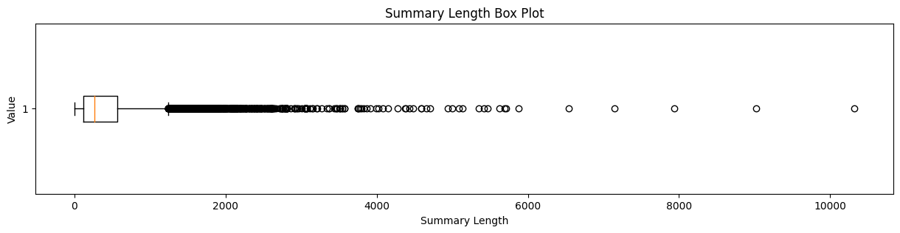</img>
</div>

<br>

<div style="text-align:center;">
    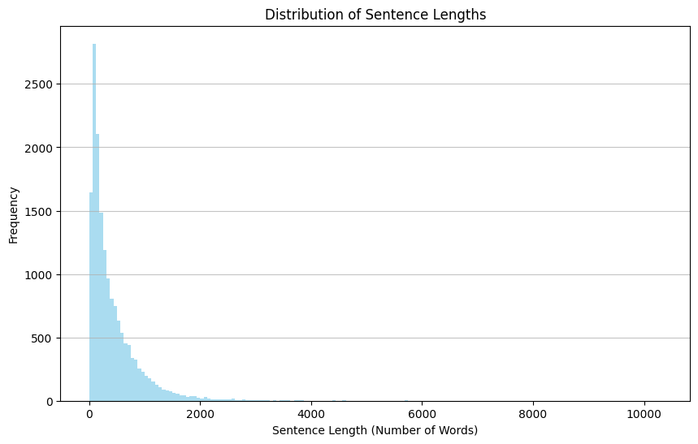</img>
</div>

<br>


- تحلیل عددی روی `Publication_Year` یعنی سال انتشار کتاب‌ها و نمایش داده های با نمودار جعبه ای

```sh
Publication year statistics:
count    16554.000000
mean      1982.597137
std         47.523203
min        398.000000
25%       1975.000000
50%       1998.000000
75%       2007.000000
max       2025.000000
```

<div style="text-align:center;">
    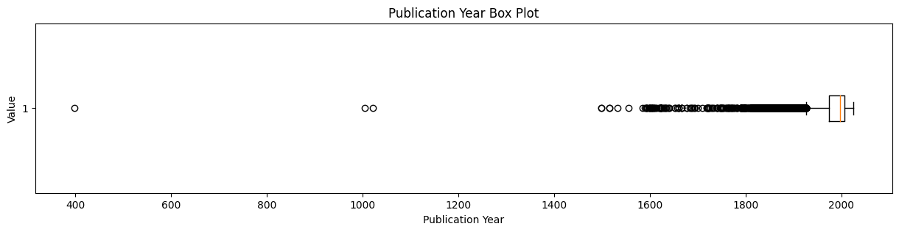</img>
</div>

<br>

- تحلیل توزیع `Publication_Year` یعنی  سال انتشار کتاب‌ها و نمایش 20 سال انتشار برتر با نمودار میله‌ای

```sh
Publication year distribution:

Publication_Year
2007.0    662
2006.0    590
2008.0    553
2009.0    552
2005.0    506
         ... 
1798.0      1
1599.0      1
1598.0      1
1021.0      1
1805.0      1
Length: 310
```

<div style="text-align:center;">
    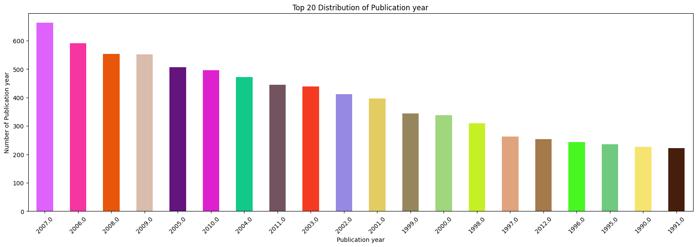</img>
</div>

<br>

- تحلیل توزیع `Book_Genres` یعنی ژانر کتاب‌ها و نمایش 10 ژانر برتر با نمودار میله‌ای. لازم به ذکر است که در این حالت هر کتاب دارای چندین ژانر بوده است و این تعداد تکرارهای هر ژانر را نمایش میدهد.

```sh
Genre distribution:
Fiction                             4745
Speculative fiction                 4310
Conspiracy                          3676
Science Fiction                     2865
Novel                               2463
                                    ... 
Neuroscience                           1
New York Times Best Seller list        1
Epic Science Fiction and Fantasy       1
Alien invasion                         1
Pastiche                               1
Length: 227
```

<div style="text-align:center;">
    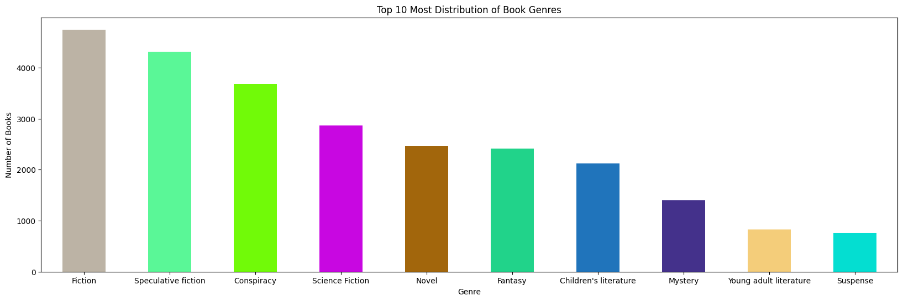</img>
</div>

<br>

- تحلیل محبوبیت نویسندگان یعنی `Author` و نمایش 20 نویسنده برتر با نمودار میله‌ای. البته در نمایش این تحلیل مقدار `Unknown` که برای داده های گمشده این ستون به کار برده شده بود حذف شده است و در نمودار نمایش داده نمیشود.

```sh
Author analysis:

Author
Unknown                 131
Franklin W. Dixon        63
K. A. Applegate          62
Edgar Rice Burroughs     59
Stephen King             57
                       ... 
Lawrence Stone            1
Joseph Rawson Lumby       1
Tamayo Akiyama            1
Ann M. M. Martin          1
Stephen Colbert           1
Length: 7062
```

<div style="text-align:center;">
    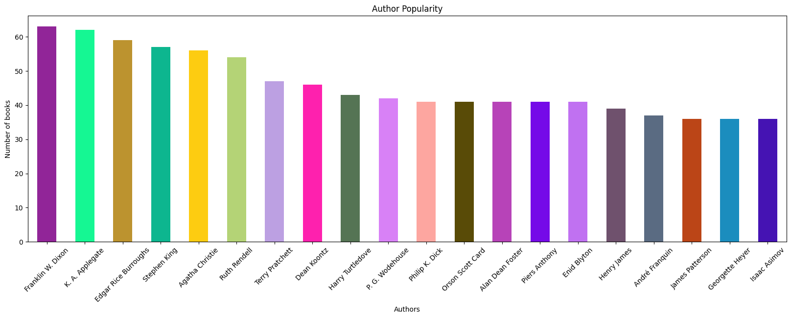</img>
</div>

<br>

- تحلیل رخداد همزمانی ژانر کتاب‌ها که یعنی چه ژانرهایی بیشترین بار با هم رخ داده‌اند و نمایش نمودار میله‌ای 10 رخداد برتر آن


```sh
(Science Fiction, Speculative fiction)    1995
(Speculative fiction, Fiction)            1992
(Speculative fiction, Fantasy)            1293
(Children's literature, Fiction)          1118
(Science Fiction, Fiction)                1090
(Fantasy, Fiction)                        1043
(Mystery, Fiction)                         852
(Fiction, Novel)                           801
(Fiction, Suspense)                        660
(Mystery, Suspense)                        650
```

<div style="text-align:center;">
    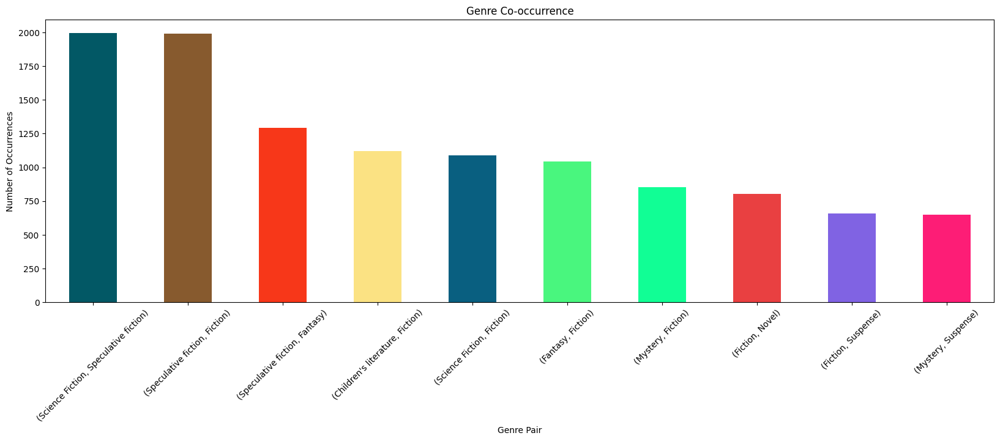</img>
</div>

<br>

- نمایش نمودار پراکندگی `Publication_Year` و `Summary_Length`

<div style="text-align:center;">
    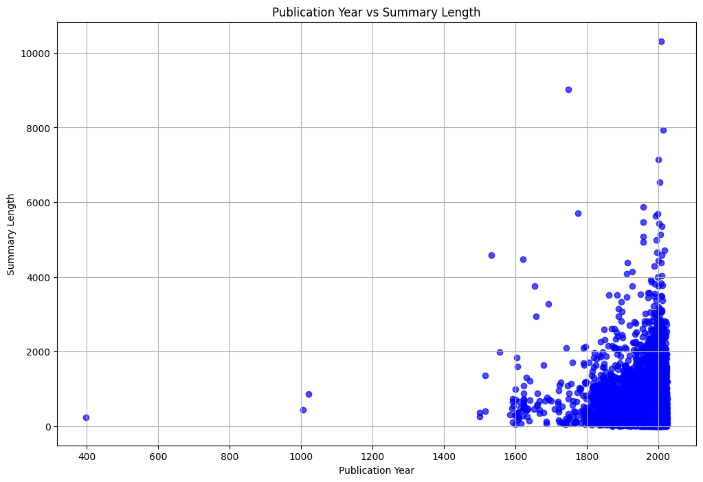</img>
</div>

<br>

- تحلیل و نمایش نمودار تعداد کلمات خلاصه کتاب ها بعد از اینکه به حالت مصدری(لم کلمات) تبدیل شده اند.

<div style="text-align:center;">
    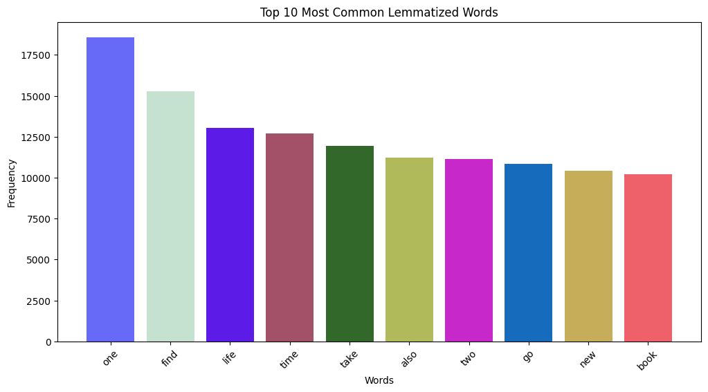</img>
</div>

<br>

- تحلیل تعداد کلمات منحصر به فرد در کل مجموعه داده

```sh
Unique vocabulary Size: 151840
```

<br>

- ساخت ابر کلمات برای کل مجموعه داده

<div style="text-align:center;">
    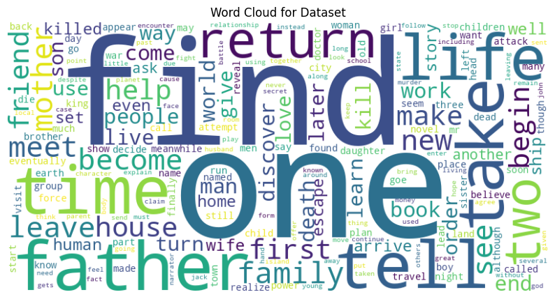</img>
</div>

<br>

- ساخت ابر کلمات برای 10 ژانر برتر کتاب‌ها

<div style="text-align:center;">
    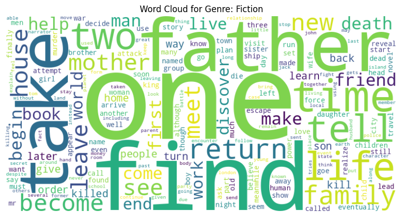</img>
</div>

<br>

<div style="text-align:center;">
    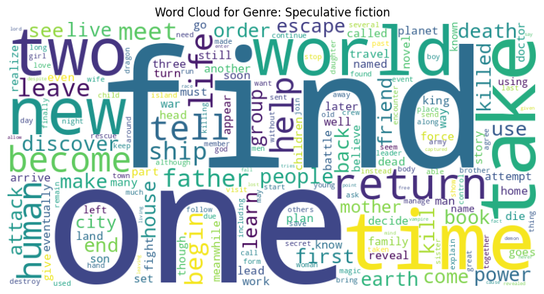</img>
</div>

<br>

<div style="text-align:center;">
    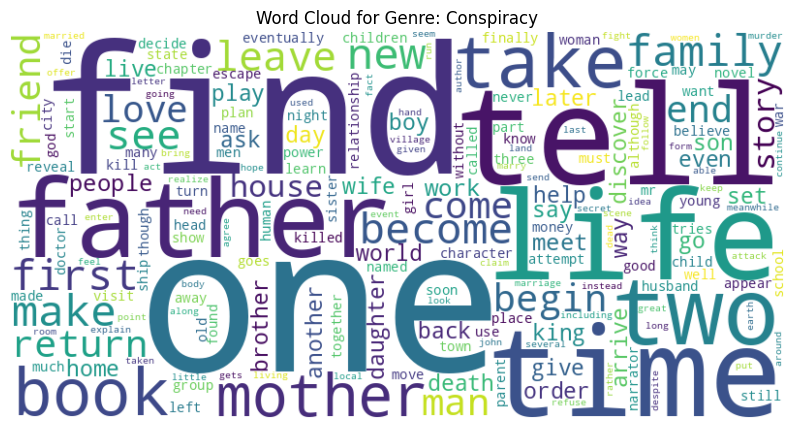</img>
</div>

<br>

<div style="text-align:center;">
    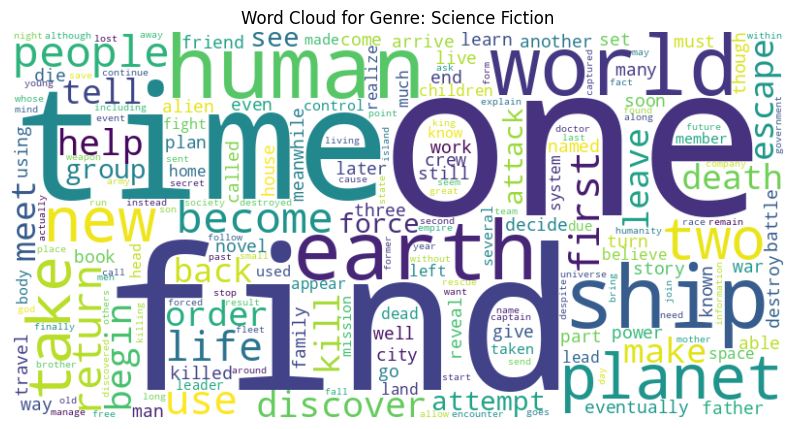</img>
</div>

<br>

<div style="text-align:center;">
    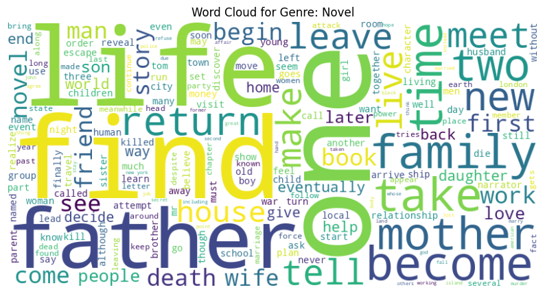</img>
</div>

<br>

<div style="text-align:center;">
    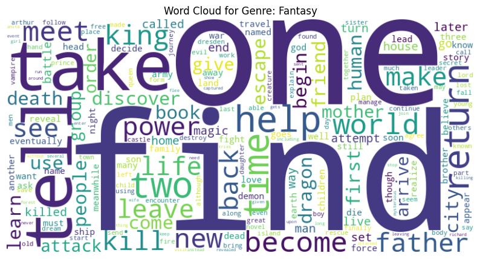</img>
</div>

<br>

<div style="text-align:center;">
    </img>
</div>

<br>

<div style="text-align:center;">
    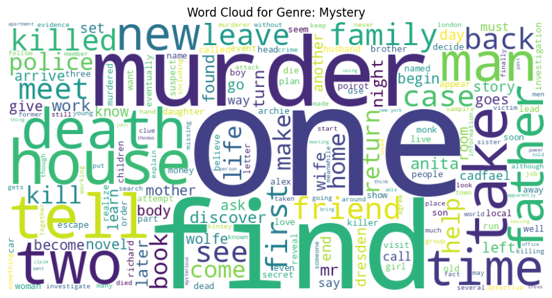</img>
</div>

<br>

<div style="text-align:center;">
    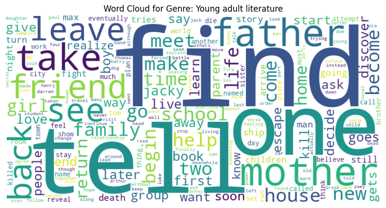</img>
</div>

<br>

<div style="text-align:center;">
    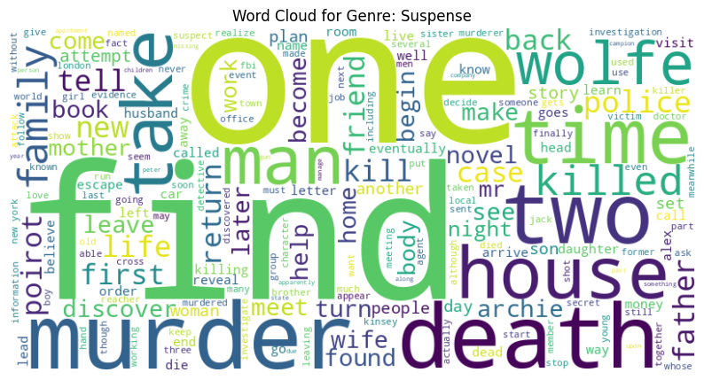</img>
</div>

<br>

- نمایش رابطه بین خلاصه متن ها و ژانرهای کتاب با استفاده از روش تبدیل TF-IDF. چون در اینجا تقریبا هیچ چیزی مشخص نیست. این کار را برای نمایش رابطه بین 10 ژانر برتر انجام داده‌ایم.

<div style="text-align:center;">
    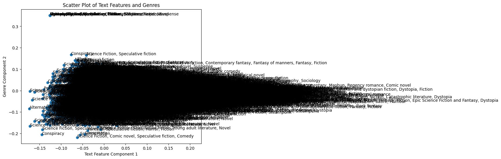</img>
</div>

<br>

- نمایش رابطه بین خلاصه متن ها و 10 ژانر برتر کتاب‌ها با استفاده از روش تبدیل TF-IDF.

<div style="text-align:center;">
    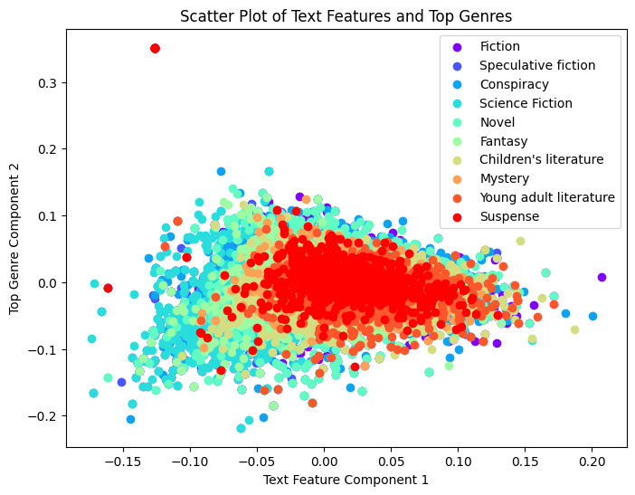</img>
</div>

<br>

- مدل سازی موضوع(Topic modeling) با استفاده از روش LDA(Latent Dirichlet Allocation)

```sh
Topic 1: 0.008*"ship" + 0.007*"find" + 0.005*"back" + 0.005*"one" + 0.004*"take" + 0.004*"escape" + 0.004*"tell" + 0.004*"go" + 0.004*"kill" + 0.003*"return"
Topic 2: 0.005*"find" + 0.005*"one" + 0.005*"world" + 0.005*"power" + 0.004*"king" + 0.004*"dragon" + 0.004*"magic" + 0.003*"kill" + 0.003*"vampire" + 0.003*"back"
Topic 3: 0.006*"king" + 0.005*"son" + 0.005*"love" + 0.004*"father" + 0.004*"brother" + 0.004*"daughter" + 0.003*"de" + 0.003*"family" + 0.003*"wife" + 0.003*"young"
Topic 4: 0.006*"book" + 0.005*"world" + 0.005*"one" + 0.004*"war" + 0.004*"novel" + 0.004*"new" + 0.004*"also" + 0.004*"time" + 0.004*"story" + 0.004*"human"
Topic 5: 0.005*"one" + 0.005*"find" + 0.005*"life" + 0.005*"go" + 0.004*"father" + 0.004*"family" + 0.004*"friend" + 0.004*"mother" + 0.004*"get" + 0.004*"tell"

Coherence Score: 0.34895238596675265
```

با توجه به خروجی که بدست آوردیم، مشاهده میشود که بر اساس مدل LDA، متن‌های به 5 موضوع مختلف تقسیم شده است. هر موضوع با لیستی از کلمات کلیدی و وزن‌های مربوطه آن کلمات نمایش داده شده است.

**تفسیر خروجی:**
- **موضوع 1**: این موضوع به نظر می‌رسد در مورد ماجراجویی ها دریایی است، با کلماتی مانند "ship"، "find"، "back"، "escape" و "kill".
  
- **موضوع 2**: این موضوع ممکن است در مورد دنیای فانتزی باشد، با کلماتی مانند "world"، "power"، "king"، "dragon" و "magic".
  
- **موضوع 3**: احتمالاً این موضوع در مورد روابط خانوادگی و اجتماعی می‌باشد، با کلماتی مانند "king"، "son"، "love"، "father" و "family".
  
- **موضوع 4**: این موضوع به نظر می‌رسد در مورد داستان‌های جدید و ادبیات است، با کلماتی مانند "book"، "novel"، "war"، "story" و "human".
  
- **موضوع 5**: این موضوع ممکن است در مورد زندگی و روابط اجتماعی باشد، با کلماتی مانند "life"، "family"، "friend"، "mother" و "tell".

**امتیاز همسانی (Coherence Score):**
- این امتیاز نشان دهنده ارتباط و پیوند معنایی بین کلمات کلیدی هر موضوع است. امتیاز بالاتر به معنای این است که کلمات کلیدی هر موضوع بیشتر به هم مرتبط هستند و موضوعات معنادارتری را نشان می‌دهند.

در مجموع، خروجی ما نشان می‌دهد که مدل LDA متن شما را به موضوعات مختلف تقسیم کرده و کلمات کلیدی هر موضوع را شناسایی کرده است. امتیاز همسانی نیز به عنوان یک معیار ارزیابی میزان ارتباط معنایی کلمات در هر موضوع ارائه شده است.


- آخرین کار انجام شده برای این بخش نیز خوشه بندی کردن خلاصه متن‌های کتاب است که با استفاده از روش `K-means Clustering` هر کتاب را به یک خوشه از پنج خوشه دسته بندی کرده و در نهایت نیز کیفیت هر خوشه را با استفاده از متریک هایی مثل `silhouette` اندازه گیری میکنیم. خروجی این قسمت نیز در فایل نوت بوک پروژه موجود است و فقط قسمتی از خروجی به عنوان نمونه در پایین آورده میشود.

```
...
Document 14524 - Cluster: 4
Document 14525 - Cluster: 1
Document 14526 - Cluster: 2
Document 14527 - Cluster: 0
Document 14528 - Cluster: 4
Document 14529 - Cluster: 3
Document 14530 - Cluster: 4
Document 14531 - Cluster: 0
Document 14532 - Cluster: 2
Document 14533 - Cluster: 0
...
```