<h1>Table of content</h1>

- [Technical assessment](#technical-assessment)
  - [Data Preprocessing](#data-preprocessing)
    - [Load and preprocessing data](#load-and-preprocessing-data)
  - [Natural Language Processing Component](#natural-language-processing-component)
  - [Predicting Book Genres Using the Bert Model](#predicting-book-genres-using-the-bert-model)
  - [Computer Vision Component](#computer-vision-component)
  - [Understanding and Exploring Dataset Features through EDA](#understanding-and-exploring-dataset-features-through-eda)


# Technical assessment

We are given the dataset [`booksummaries.txt`](../booksummaries.txt) and aim to create a Python script or notebook that combines NLP, Computer Vision, Machine Learning and Data Visualization to analyze and understand a dataset of book summaries. This includes cleaning the data, exploring its features through EDA, shortening the summaries and converting them to images, which we describe in detail below. And we want to get " The condensed text summaries", "The converted images" and " The findings from the exploratory data analysis (EDA)" by doing these steps.


## Data Preprocessing

### Load and preprocessing data

- Loading environment variables
- Loading the data using the pandas library and adding a header to it.
- Display head of the data and shape of it.
- In this section, we can remove the `Wikipedia_Article_ID` and `Freebase_ID` columns from the data because it is unique and also ineffective, but we will not remove it due to the task.
- Adding an index to the dataset.
- Cleaning the genres of books and changing its structure from a dictionary to a list of genres by removing keys that are `Freebase_ID`.
- We check which columns have missing values. Based on the results, the columns `Author`, `Publication_Date`, and `Book_Genres` have missing values.
- In this section, we also use the **Google Books API** to retrieve and store book information, namely `Author` and `Publication_Date`, based on `Book_Title` and `Author` if available.
- As the first checkpoint, we save the dataset for assurance. [ِDataset link](../checkpoint_datasets/checkpoint1_book_summaries.csv)
- Adding the `Publication_Year` column based on the `Publication_Date` column, which only contains the year of publication of the book.
- We identify the number of duplicate rows based on the columns `Book_Title` and `Author`.
- Cleaning the `Plot_Summary` column by converting to lowercase, removing punctuation marks, digits, extra spaces, special characters, leading and trailing white spaces, and then checking if the cleaned text is empty or not. If it is empty, the value will be set to `NaN`, otherwise, the `cleaned text` will be recorded as the new content in the `Cleaned_Summary` column.
- Dropping records where the `Cleaned_Summary` column does not have a value.
- Adding a column `Summary_Length` to store the length of `Cleaned_Summary` and identifying outliers using the IQR method based on these values in the same column.
- Filling missing data in the `Author` column with the value `Unknown` since we cannot attribute a book to a different person and the author's name was not found through the Google Books API.
- Filling missing data in the `Book_Genres` based on the `Author` and other genres of books by this author that are available. Identifying the 5 common genres of books by this author.
- Checking the number of missing values in the dataset
- Calculating the median, mode, and mean of the `Publication year` and plotting a histogram to determine which of these measures is suitable for the missing `Publication Year` and `Publication date` data.

<div style="text-align:center;">
    </img>
</div>

- Due to the overlap and abundance of data, it was not informative to plot a histogram. Therefore, we plot the histogram for the Top 10 years to see that all of these top 10 years belong to the period after 2000. Hence, we use the mode as a value to fill in the missing `Publication Year` and `Publication date` data.

<div style="text-align:center;">
    </img>
</div>

- We are examining which columns have missing values and find that the only column with missing data is the `Book_Genres` column. Therefore, we proceed to step 2 and begin generating summaries of the relevant texts. And finally, we save the data set as the second check point. [Dataset Link](../checkpoint_datasets/cleaned_book_summaries.csv)


## Natural Language Processing Component

In this section, the task requested from us was to convert the summaries of books available in the dataset into shorter summaries. We chose the model `facebook/bart-large-cnn`, commonly known as BART, among three models BART, T5, and PEGASUS because it excelled in providing high-quality summaries with excellent compression. We prepared the model to utilize GPU if available, and if not, to use CPU. Two functions named `summarize_batch` and `batch_summarization` were defined. The first function is responsible for taking a batch of texts and summarizing them using the BART model, while the second function manages the dataset and sends it batch by batch to avoid memory errors.

Afterwards, two texts were given as samples to the model, with the first text being the longest text in the dataset and the second text being the first text in the dataset. The accuracy and length of the summarized text were evaluated, and the results are presented below. For the first text, which was originally 10,317 tokens long, after using the model and summarizing the text, it was reduced to 51 tokens. The second text, originally 944 tokens long, was reduced to 65 tokens after using this model and summarizing the text.

The model's accuracy results for summarizing this first text are as follows, obtained using the `rouge_score` library.

```sh
Cleaned Summary lenght: 10317
Summarized Text lenght: 51


ROUGE-1:  Score(precision=1.0, recall=0.004935165473195278, fmeasure=0.009821858449687049)
ROUGE-2:  Score(precision=0.62, recall=0.0030000967773153972, fmeasure=0.0059712992391409035)
ROUGE-L:  Score(precision=0.8235294117647058, recall=0.004064253919101994, fmeasure=0.008088589311506982)
```
<br>


The ROUGE scores obtained for the longest text in the dataset provide us with valuable insights into the performance of summarization model. Below is an analysis of these results:

<h3>ROUGE-1:</h3>

- **Precision = 1.0**: This indicates that 100% of the unigrams (individual words) in the summary are present in the original text. The summary is exclusively composed of words from the original.
- **Recall = 0.0049**: Only about 0.49% of the unigrams from the original text are included in the summary. This very low recall suggests the summary is extremely condensed.
- **F1-Score = 0.0098**: The harmonic mean between precision and recall is low due to the significant gap between the two. While the model captures every word it chooses with perfect precision, it includes very few words from the original.

<h3>ROUGE-2:</h3>

- **Precision = 0.62**: This means 62% of the bigrams (pairs of consecutive words) in the summary are present in the original text. However, this isn't as high as the unigram precision, indicating that while individual words are captured well, their order might not be as well preserved.
- **Recall = 0.0030**: About 0.3% of the bigrams from the original text are present in the summary, which suggests that only a very tiny fraction of the original bigram content is captured.
- **F1-Score = 0.0060**: The F1 score is quite low due to the large gap between precision and recall, indicating that the summary may be missing important contextual sequences of words.

<h3>ROUGE-L:</h3>

- **Precision = 0.824**: Around 82.4% of the longest common subsequences (LCS) between the summary and original text are preserved, which suggests the model does a reasonable job of maintaining word order for the parts of the original text it includes.
- **Recall = 0.0041**: Only 0.41% of the sequences from the original text appear in the summary, indicating that while the word order is preserved, a very small amount of content is actually included.
- **F1-Score = 0.0081**: The low F1 score again reflects the tension between high precision and low recall, meaning the model extracts sequences faithfully but covers only a tiny portion of the original text.

<h3>Interpretation:</h3>

- **High precision, low recall**: Across all the ROUGE scores, precision is relatively high (especially for ROUGE-1), but recall is extremely low. This suggests that the model creates **very short summaries**, where most of the content is omitted, but what is included is perfectly selected.
- **Condensed summary**: Given the very low recall (~0.49% for ROUGE-1 and ~0.3% for ROUGE-2), it seems the summary is heavily reduced in length and content compared to the original text.
- **Bigram and sequence preservation**: While bigram precision and LCS precision are somewhat decent, the low recall shows that the summary may not be capturing much of the original context or detail.

<h3>Summary of Findings:</h3>

- Your summarization model is **highly precise** in choosing words and maintaining word order from the original text, but it summarizes the text in a very condensed form, leading to a **low recall**.
- If you're aiming for **concise summaries**, this may be acceptable, but the summaries may be missing a lot of important content.
- If our goal is to generate **short, accurate summaries**, this level of compression may be ideal, aligning with our objective. On the other hand, if we aim to preserve more content from the original material, we might need to **increase the summary length** (adjusting `max_output_length`) or adjust the model parameters.


```sh
Cleaned Summary lenght: 944
Summarized Text lenght: 65


ROUGE-1:  Score(precision=1.0, recall=0.06885593220338983, fmeasure=0.12884043607532208)
ROUGE-2:  Score(precision=1.0, recall=0.06786850477200425, fmeasure=0.12711022840119168)
ROUGE-L:  Score(precision=1.0, recall=0.06885593220338983, fmeasure=0.12884043607532208)
```

The obtained ROUGE scores provide some useful insights into the performance of the summarization model. Below is an analysis based on the provided scores:

<h3>ROUGE-1:</h3>

- **Precision = 1.0**: This means 100% of the unigrams (individual words) in the summary are found in the original text. The summary doesn’t introduce any new words, only using words from the original.
- **Recall = 0.0689**: About 6.89% of the unigrams from the original text are present in the summary. This indicates that only a small portion of the original content is captured in the summary.
- **F1-Score = 0.1288**: The F1 score, which is the harmonic mean between precision and recall, reflects a balance between the two. While the precision is perfect, the low recall keeps the F1 score down.

<h3>ROUGE-2:</h3>

- **Precision = 1.0**: All of the bigrams (pairs of consecutive words) in the summary are directly taken from the original text, so there is no deviation from the word order or word choice.
- **Recall = 0.0679**: Only about 6.79% of the bigrams from the original text are captured in the summary, meaning that very few sequences of two consecutive words are included.
- **F1-Score = 0.1271**: This score reflects the balance between the perfect precision and the low recall, showing that while the summary is accurate in terms of bigram usage, it captures only a small part of the original.

<h3>ROUGE-L:</h3>

- **Precision = 1.0**: The longest common subsequences (LCS) in the summary are perfectly matched to those in the original text, so word order is faithfully preserved.
- **Recall = 0.0689**: Similar to ROUGE-1, only 6.89% of the sequences from the original text are included in the summary, highlighting how much of the original content is omitted.
- **F1-Score = 0.1288**: The F1 score indicates a decent balance between precision and recall, where precision is perfect but recall is quite low.

<h3>Interpretation:</h3>

- **Perfect precision (1.0)**: The summary is highly faithful to the original text, as every word, bigram, and sequence in the summary appears in the original. There is no extraneous or erroneous content.
- **Low recall (~6.9%)**: The summary is very condensed, including less than 7% of the original content. This suggests that while the summary is accurate, it covers only a small portion of the original text.
- **F1-scores (~0.128)**: The F1-scores reflect the model’s high precision but low recall, meaning it does a good job of capturing the words and phrases it chooses but doesn’t include much of the original content.

<h3>Summary of Findings:</h3>

- The model generates summaries that are **extremely precise**, ensuring that all words and sequences in the summary are drawn from the original text.
- However, the **low recall** indicates that the summaries omit a significant portion of the original content, making them highly condensed.
- If our goal is to generate **short, accurate summaries**, this level of compression may be ideal, aligning with our objective. On the other hand, if we aim to preserve more content from the original material, we might need to **increase the summary length** (adjusting `max_output_length`) or adjust the model parameters.

Finally, these codes are executed, and a portion of the generated summaries along with the original text are displayed. Finally, we add the results of this part as a column 'Summarized_Text' to the dataset and save the dataset file in CSV format. [Dataset Link](../checkpoint_datasets/summarized_book_summary.csv)


## Predicting Book Genres Using the Bert Model

- In this section, first, we read the saved dataset from the previous part and convert the genres of the books into a list of genres.
- We save the unique genres in the dataset for predicting the genres of books whose genres are not specified.
- We use a pre-trained model `bert-large-uncased` which, based on the list of unique genres from the previous step, reads the main summary text of the book or the generated summary and selects the genres with probabilities higher than a certain threshold. If there is no genre with a probability higher than this threshold, it selects the first selected genre with the highest probability for the book.
- Finally, we save the dataset as the final file for this task in CSV format. [Final Dataset Link](../final_book_summaries.csv)


To manage missing data, there are various methods available. We employed one for the column `Book genres`, which involves predicting the genres of books based on the other works of the author and identifying the 5 common genres from these other works. However, there are other methods that we could use, and we mention three that are relevant to this issue. The first method we cannot use is the `Forwardfill/Backwardfill` method, which can fill in missing data if there is a logical sequence in the data. Another method involves using external sources to find data, such as using external datasets, APIs (like Google Books API, GoodReads, or Freebase), or by writing a web scraper to find the required information (apparently, the values in the `Wikipedia article ID` column are not valid), which we used to determine the `Author` and `Publication_Date` features. Please note that this API has limitations, likely around 1000 requests per day.

The third method involves using a pre-trained NLP model to specifically identify book genres according to our needs. While such a model was not readily available, we employed multiple methods other than the aforementioned method to identify missing data in `Book_Genres`. The first method we used was machine learning algorithms to predict book genres. With our dataset, we utilized the `Naive Bayes` algorithm, considering the book summary text as input and the book genres as labels, but the model's accuracy was `0.0`. Subsequently, we tried using `random forest` as well, but due to memory limitations in Google Colab, this method also failed. We then employed the pre-trained NLP model `bert-large-uncased`, trained it according to our requirements, but due to various reasons, including potential data scarcity, this method failed to provide satisfactory results. Finally, we utilized the pre-trained NLP model `bert-large-uncased` without training it and instructed it to select genres from our list of unique genres based on the book summary text. Although the model's accuracy was not high according to conducted tests, this was the only method that yielded results for this dataset, as explained above.


## Computer Vision Component

In this section, we have been asked to use the generated summaries of books from the previous stage to convert these texts into images using text-to-image models. For this task, we utilized the `CompVis/stable-diffusion-v1-4` model. (If you wonder why we did not use version 1.5, it was because it was not available despite being mentioned on [huggingface](https://huggingface.co/docs/diffusers/en/api/pipelines/stable_diffusion/text2img) and its documentation being present, we encountered a 404 error when trying to download the model.)

For this section, three functions `text_to_image`, `batch_text_to_images`, and `display_image` have been written. The first function is responsible for converting the input text into an image and delivering it to us. In this section, variables have also been defined so that we can have more control over the desired output, such as the image's width and height, as well as the number of images generated for the input text. The second function sends batches of text data to the first function, which manages memory efficiently to prevent Memory Errors and ensures that we do not encounter errors due to time constraints when using the GPU in Google Colab, allowing us to utilize resources optimally within the timeframe provided. The third function takes an image as input and displays it, used solely for testing the model by sending it text to generate and display an image as an example. When running the model, we encountered an `NSFW filter` error. After researching this error, we found a solution that allows the model to generate these images freely and without any restrictions. However, because we intended to make this repository public and due to international laws and platform regulations, we did not enable it. Finally, 1024 images were randomly selected from the dataset summaries and placed in the repository.


## Understanding and Exploring Dataset Features through EDA

For exploring the dataset and analyzing its features, numerical analysis has been conducted for numerical data and non-numerical analysis for non-numerical features such as book genres. Below are the steps described in order:

- Reading the dataset stored from the previous stage, saved in a CSV file.
- Converting the book genres into a list of genres for non-numerical analysis.
- Printing basic information about the dataset such as the number of books and missing data.

```sh
Number of books: 16554
Missing values: False
```

- Performing numerical analysis on `Summary_Length`, which refers to the length of book summaries, and visualizing the data using a box plot and histogram

```sh
Summary length statistics:
count    16554.000000
mean       427.477528
std        498.249186
min          1.000000
25%        120.000000
50%        262.000000
75%        566.750000
max      10317.000000
```

<div style="text-align:center;">
    </img>
</div>

<br>

<div style="text-align:center;">
    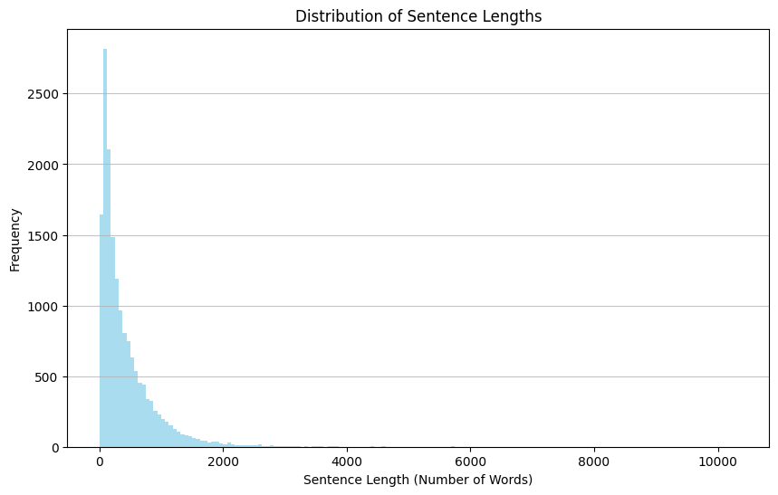</img>
</div>

<br>


- Performing numerical analysis on `Publication_Year`, which refers to the publication year of books, and displaying the data using a box plot.


```sh
Publication year statistics:
count    16554.000000
mean      1982.597137
std         47.523203
min        398.000000
25%       1975.000000
50%       1998.000000
75%       2007.000000
max       2025.000000
```

<div style="text-align:center;">
    </img>
</div>

<br>

- Analyzing the distribution of `Publication_Year`, which refers to the years of publication of books, and displaying the top 20 publication years with a bar chart.

```sh
Publication year distribution:

Publication_Year
2007.0    662
2006.0    590
2008.0    553
2009.0    552
2005.0    506
         ... 
1798.0      1
1599.0      1
1598.0      1
1021.0      1
1805.0      1
Length: 310
```

<div style="text-align:center;">
    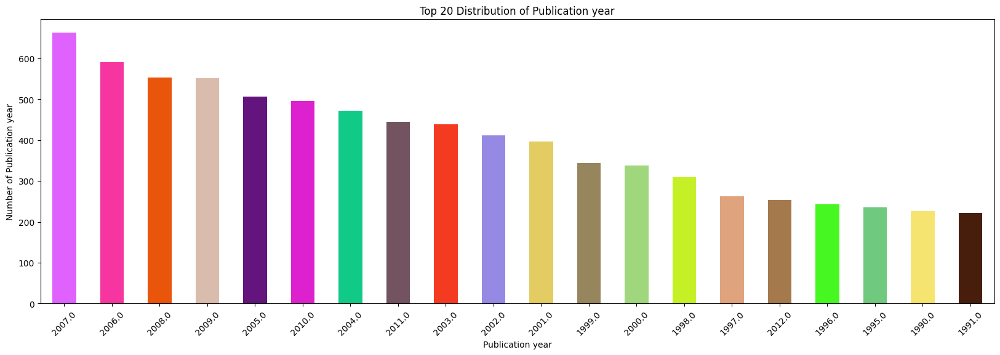</img>
</div>

<br>


- Analyzing the distribution of `Book_Genres`, which represents the genres of books, and displaying the top 10 genres with a bar chart. It is worth mentioning that in this case, each book may have multiple genres, and this count reflects the frequency of each genre.

```sh
Genre distribution:
Fiction                             4745
Speculative fiction                 4310
Conspiracy                          3676
Science Fiction                     2865
Novel                               2463
                                    ... 
Neuroscience                           1
New York Times Best Seller list        1
Epic Science Fiction and Fantasy       1
Alien invasion                         1
Pastiche                               1
Length: 227
```

<div style="text-align:center;">
    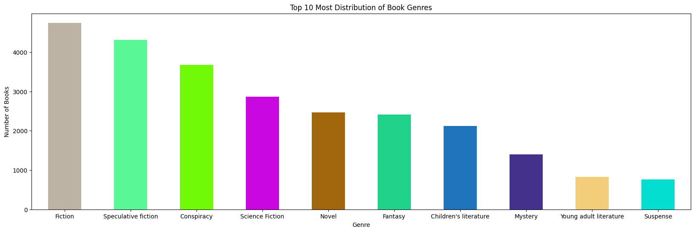</img>
</div>

<br>

- Analyzing the popularity of authors (`Author`) and displaying the top 20 authors with a bar chart. However, in visualizing this analysis, the value `Unknown`, which was used for missing data in this column, has been removed and is not shown in the chart.


```sh
Author analysis:

Author
Unknown                 131
Franklin W. Dixon        63
K. A. Applegate          62
Edgar Rice Burroughs     59
Stephen King             57
                       ... 
Lawrence Stone            1
Joseph Rawson Lumby       1
Tamayo Akiyama            1
Ann M. M. Martin          1
Stephen Colbert           1
Length: 7062
```

<div style="text-align:center;">
    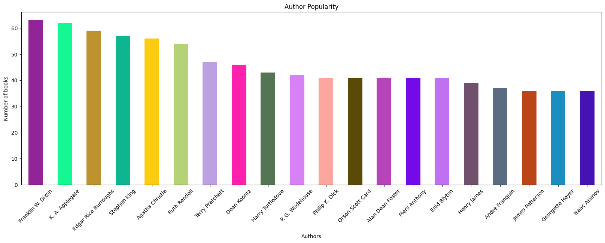</img>
</div>

<br>

- Analyzing the co-occurrence of book genres, which indicates which genres have occurred together most frequently, and displaying the top 10 co-occurrences with a bar chart.


```sh
(Science Fiction, Speculative fiction)    1995
(Speculative fiction, Fiction)            1992
(Speculative fiction, Fantasy)            1293
(Children's literature, Fiction)          1118
(Science Fiction, Fiction)                1090
(Fantasy, Fiction)                        1043
(Mystery, Fiction)                         852
(Fiction, Novel)                           801
(Fiction, Suspense)                        660
(Mystery, Suspense)                        650
```

<div style="text-align:center;">
    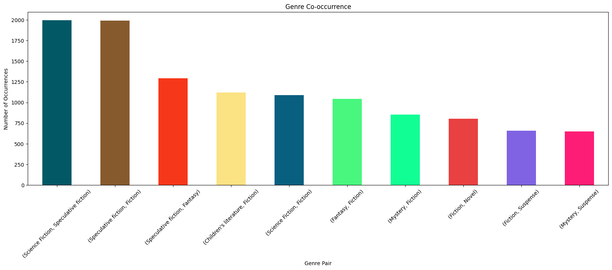</img>
</div>

<br>

- Displaying a scatter plot of `Publication_Year` and `Summary_Length`.

<div style="text-align:center;">
    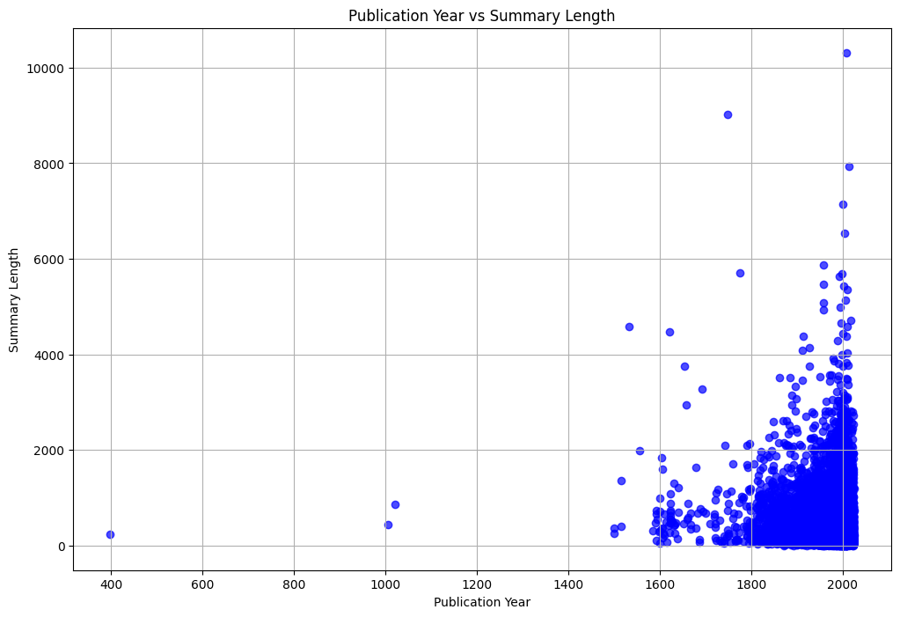</img>
</div>

<br>

- Analyzing and displaying a plot of the total number of words in book summaries after being transformed into their base form (lemmatized).

<div style="text-align:center;">
    </img>
</div>

<br>

- Analyzing the number of unique vocabularies in the entire dataset.

```sh
Unique vocabulary Size: 151840
```

<br>

- Creating a word cloud for the entire dataset.

<div style="text-align:center;">
    </img>
</div>

<br>

- Creating word clouds for the top 10 genres of books.

<div style="text-align:center;">
    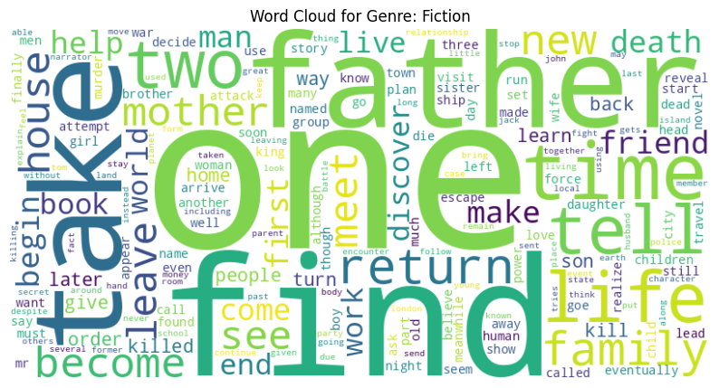</img>
</div>

<br>

<div style="text-align:center;">
    </img>
</div>

<br>

<div style="text-align:center;">
    </img>
</div>

<br>

<div style="text-align:center;">
    </img>
</div>

<br>

<div style="text-align:center;">
    </img>
</div>

<br>

<div style="text-align:center;">
    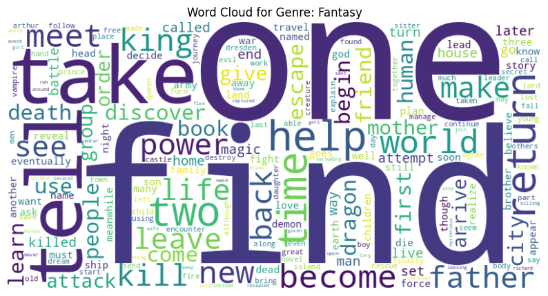</img>
</div>

<br>

<div style="text-align:center;">
    </img>
</div>

<br>

<div style="text-align:center;">
    </img>
</div>

<br>

<div style="text-align:center;">
    </img>
</div>

<br>

<div style="text-align:center;">
    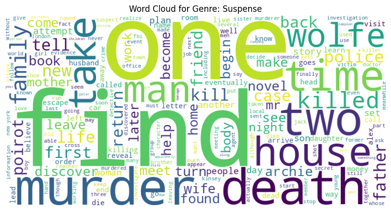</img>
</div>

<br>

- Displaying the relationship between book summaries and book genres using the TF-IDF transformation method. Since there is little clarity here, we have performed this task to show the relationship between the top 10 genres.

<div style="text-align:center;">
    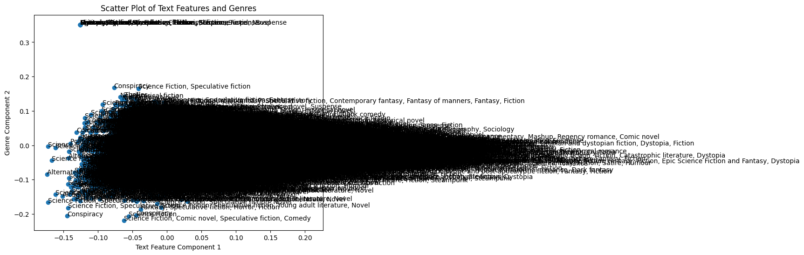</img>
</div>

<br>

- Displaying the relationship between book summaries and the top 10 genres of books using the TF-IDF transformation method.

<div style="text-align:center;">
    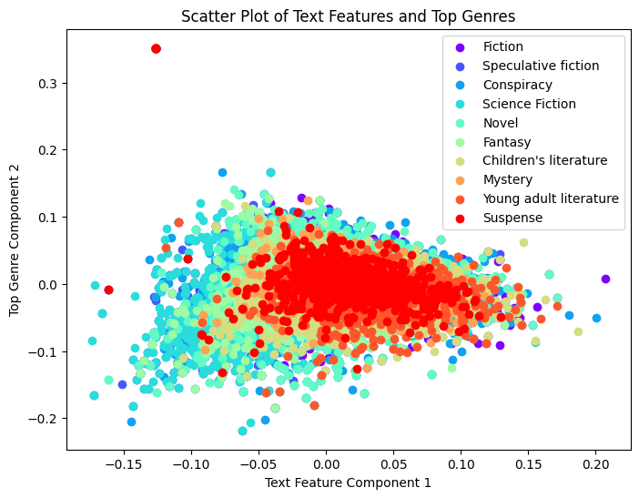</img>
</div>

<br>

- Topic modeling using the Latent Dirichlet Allocation (LDA) method.

```sh
Topic 1: 0.008*"ship" + 0.007*"find" + 0.005*"back" + 0.005*"one" + 0.004*"take" + 0.004*"escape" + 0.004*"tell" + 0.004*"go" + 0.004*"kill" + 0.003*"return"
Topic 2: 0.005*"find" + 0.005*"one" + 0.005*"world" + 0.005*"power" + 0.004*"king" + 0.004*"dragon" + 0.004*"magic" + 0.003*"kill" + 0.003*"vampire" + 0.003*"back"
Topic 3: 0.006*"king" + 0.005*"son" + 0.005*"love" + 0.004*"father" + 0.004*"brother" + 0.004*"daughter" + 0.003*"de" + 0.003*"family" + 0.003*"wife" + 0.003*"young"
Topic 4: 0.006*"book" + 0.005*"world" + 0.005*"one" + 0.004*"war" + 0.004*"novel" + 0.004*"new" + 0.004*"also" + 0.004*"time" + 0.004*"story" + 0.004*"human"
Topic 5: 0.005*"one" + 0.005*"find" + 0.005*"life" + 0.005*"go" + 0.004*"father" + 0.004*"family" + 0.004*"friend" + 0.004*"mother" + 0.004*"get" + 0.004*"tell"

Coherence Score: 0.34895238596675265
```

Based on the output we obtained, it can be observed that according to the LDA model, the texts have been divided into 5 different topics. Each topic is represented with a list of key words and their corresponding weights.

**Interpretation of the Output:**
- **Topic 1**: This topic appears to be about maritime adventures, with words like "ship," "find," "back," "escape," and "kill."
  
- **Topic 2**: This topic might be related to the fantasy world, with words like "world," "power," "king," "dragon," and "magic."
  
- **Topic 3**: Likely, this topic is about family and social relationships, with words like "king," "son," "love," "father," and "family."
  
- **Topic 4**: This topic seems to be about new stories and literature, with words like "book," "novel," "war," "story," and "human."
  
- **Topic 5**: This topic could be about life and social relationships, with words like "life," "family," "friend," "mother," and "tell."

**Coherence Score:**
- This score indicates the semantic coherence and meaningful connections between the key words of each topic. A higher score implies that the key words of each topic are more closely related to each other, indicating more meaningful topics.

Overall, our output shows that the LDA model has segmented your text into different topics and identified the key words for each topic. The Coherence Score serves as an evaluation metric for assessing the semantic coherence of words within each topic.

- The latest task conducted for this section also involves clustering the book summaries. Using the `K-means Clustering` method, each book is categorized into one of five clusters, and ultimately, the quality of each cluster is measured using metrics such as `silhouette`. The output of this section is also available in the project notebook, and only a portion of the output is provided below as an example.

```
...
Document 14524 - Cluster: 4
Document 14525 - Cluster: 1
Document 14526 - Cluster: 2
Document 14527 - Cluster: 0
Document 14528 - Cluster: 4
Document 14529 - Cluster: 3
Document 14530 - Cluster: 4
Document 14531 - Cluster: 0
Document 14532 - Cluster: 2
Document 14533 - Cluster: 0
...
```